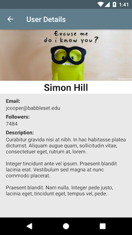

# Android Clean Architecture Boilerplate #

The following project is a POC for getting knowledge about applying Clean Architecture in order to build an Android application.

It's written 100% in Java, pending to convert it to Kotlin. It has unit tests and I try to be keeping up-to-date as libraries changes.

The sample app when run will show you a simple list of people and you can access to the detailed view of each one:

### [Clean Architecture](https://blog.cleancoder.com/uncle-bob/2012/08/13/the-clean-architecture.html) ###

The architecture of the project follows the principles of Clean Architecture:

### Languages, libraries and tools used ###

- Java
- [Android API](https://developer.android.com/reference)
- [ButterKnife](http://jakewharton.github.io/butterknife)
- [Dagger](https://google.github.io/dagger)
- [Glide](https://github.com/bumptech/glide)
- [OkHttp](https://square.github.io/okhttp)
- [Retrofit](https://square.github.io/retrofit)
- [RxJava](https://github.com/ReactiveX/RxJava) and [RxAndroid](https://github.com/ReactiveX/RxAndroid)
- [Timber](https://github.com/JakeWharton/timber)
- [EasyMock](http://easymock.org)
- [Mockito](https://site.mockito.org)
- [PowerMock](https://github.com/powermock/powermock)
- [Robolectric](http://robolectric.org)

### Requirements ###

- [JDK 1.8](https://www.oracle.com/technetwork/java/javase/downloads/jdk8-downloads-2133151.html)
- [Android SDK](https://developer.android.com/studio)
- Android O ([API 28](https://developer.android.com/about/versions/pie/android-9.0))
- Latest Android SDK Tools and build tools
